# Electronics Shop: An E-commerce store using Mern Stack with typescript

# 🌟 About the Project

 Electronics-Shot is an ecommerce full stack web application with using react with typescript for frontend redux toolkit for state management including authentication with roles and full crud cms admin dashboard, node with typescript express js for backend and mongodb for database.

# 📔 Table of Contents

    1. Screenshots
    2. Tech Stack
    3. Features

##  📷 Screenshots

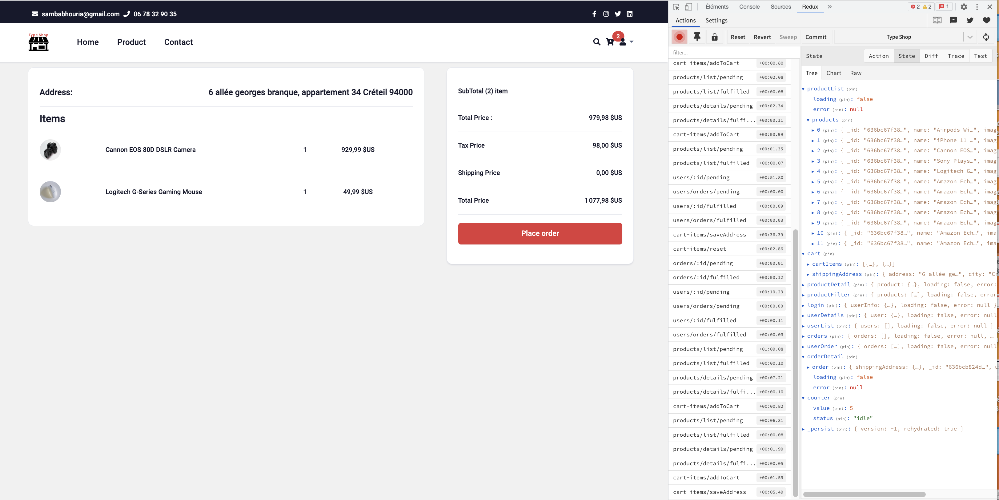

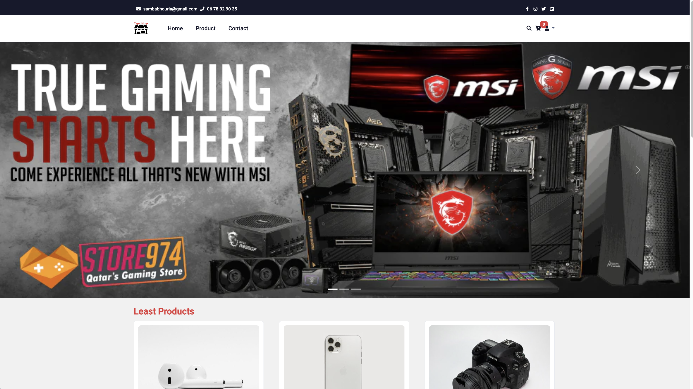

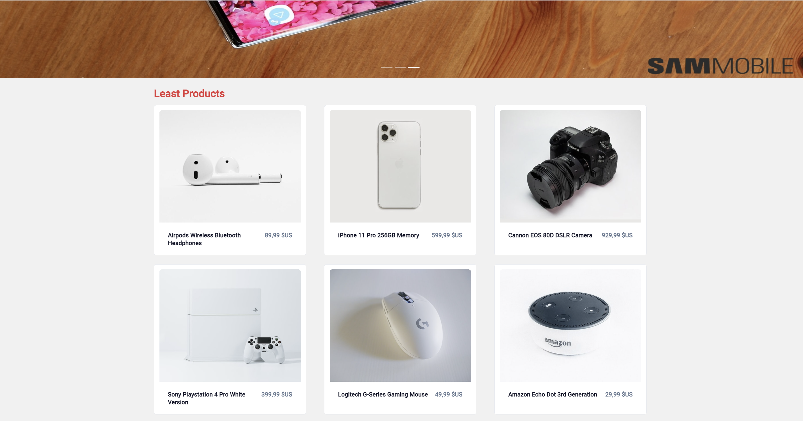

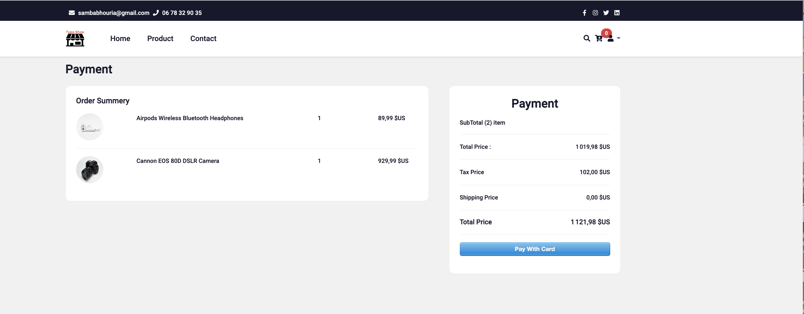

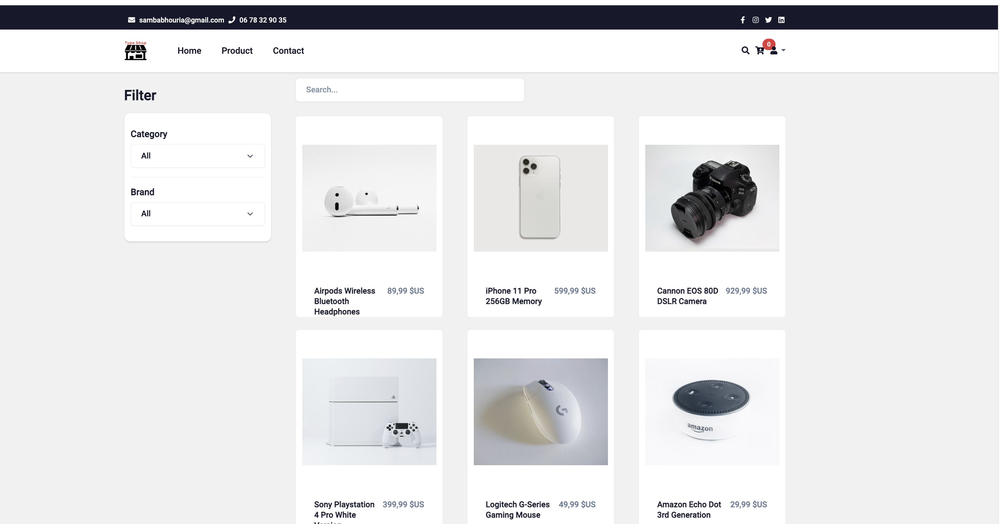

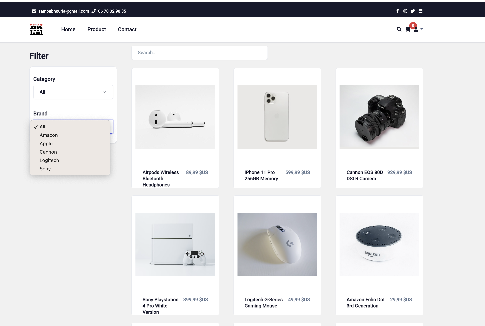

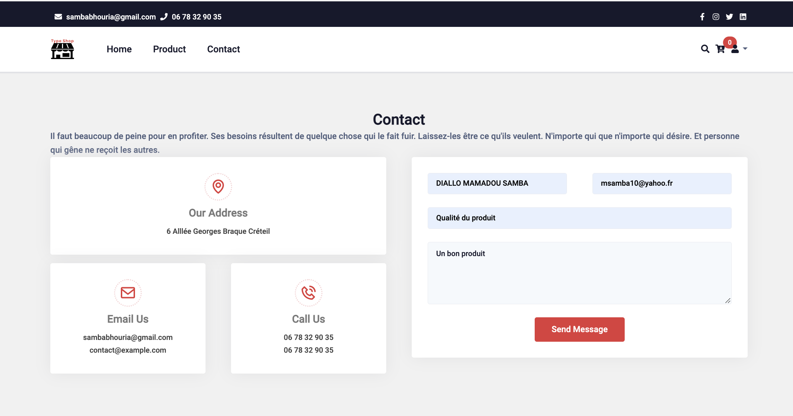

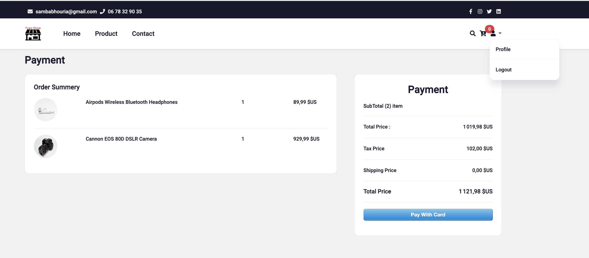

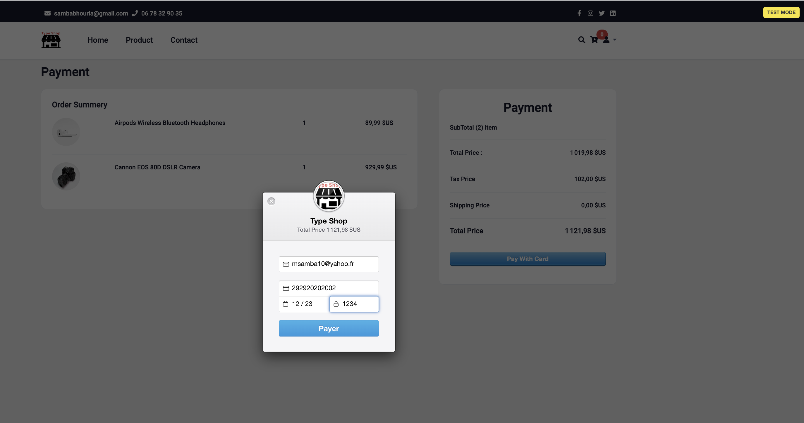

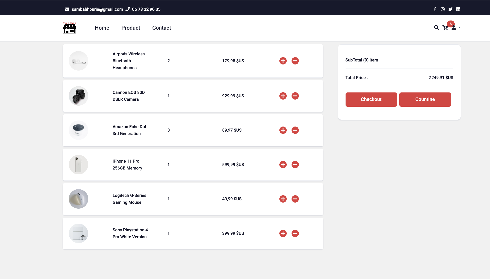

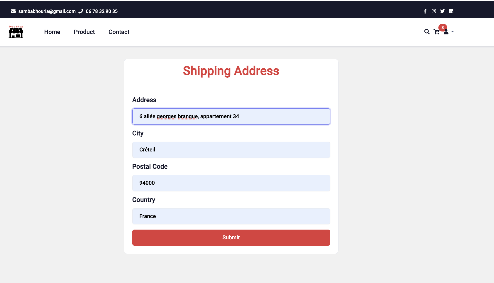

## 👾 Tech Stack

### Client
    1. Typescript
    2. React.js
    3. React Bootstrap
    4. Redux Toolkit

### Server
    1. Typescript
    2. Node.js
    3. Express.js
### Database
    1. MongoDB

## 🎯 Features
1 Select Product
2 Add to  Cart
3 Add Adreess
4 . Paypal
5 . Google map
6 . Content management system

# 🧰 Getting Started

This project uses Yarn as package manager

 npm install --global yarn

# ⚙️ Installation

  yarn install my-project
  cd my-project
# 🧪 Running Tests

  yarn test test
